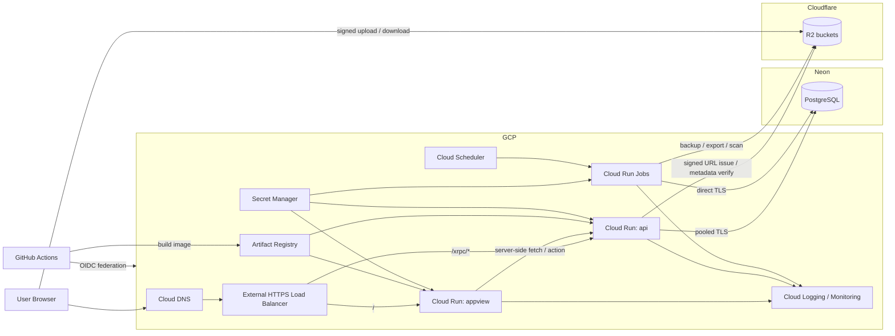

# GCP Cloud Run + Neon + R2 ホスティング / 運用方針

## 目的

この文書は、Cerulia を GCP Cloud Run + Neon + Cloudflare R2 で長期運用するための、既定の配置構成、運用フロー、環境分離、必要な周辺サービスを固定するための文書である。

狙いは次の 3 つである。

- 10 年単位で運用しても、DB・blob・deploy・復旧の責務が散らばりすぎないこと
- インフラ運用を Kubernetes や self-managed PostgreSQL に広げず、少人数で保てること
- [Go サーバー実装計画](implementation-plan.md) と [SvelteKitベースAppView実装計画](../appview/implementation-plan.md) の前提を崩さずに、本番運用へ落とせること

この文書は record semantics や projection contract を定義するものではない。そこは既存の architecture / records / lexicon docs を正本とする。

## 採用構成

| レイヤー | 採用 | 役割 |
| --- | --- | --- |
| edge / DNS | Cloud DNS + Google Cloud External HTTPS Load Balancer | `cerulia.app` の入口、TLS 終端、path routing |
| AppView | Cloud Run `appview` | SvelteKit BFF / SSR shell |
| API | Cloud Run `api` | Go 製 XRPC / 補助 HTTP |
| batch / ops | Cloud Run Jobs + Cloud Scheduler | migration、backup、projection rebuild、整合性検査 |
| database | Neon PostgreSQL | append-only ledger、current head、projection table、service log |
| blob | Cloudflare R2 | asset、secret payload、audit detail の object storage |
| secret / config | Secret Manager | 機密値の集中管理 |
| build / release | GitHub Actions + Artifact Registry + Workload Identity Federation | build、deploy、promotion |
| observability | Cloud Logging、Cloud Monitoring、Uptime Check、OpenTelemetry | 監視、アラート、調査 |

この構成では、GCP を front door / app runtime / job runtime / observability に集中させ、DB は Neon、blob は R2 に明確に分離する。責務の境界が単純で、かつ self-managed DB を避けられるため、ヒューマンコストが低い。

## 既定の公開境界

- `cerulia.app` と `www.cerulia.app` は AppView へ向ける
- `cerulia.app/xrpc/*` は API へ path routing する
- 必要になるまでは `api.cerulia.app` を必須にしない
- Cloud Run の直 URL は user-facing canonical URL にしない
- Cloud Run service の ingress は `internal-and-cloud-load-balancing` を基本にし、LB 経由以外の直接流入を避ける

これにより、AppView 側の same-origin 導線を確保しつつ、内部的には SvelteKit server load / action から API へ直接 service-to-service call を使える。

## 構成図

## コンポーネント責務

### 1. Cloud Run `appview`

- SvelteKit adapter-node を載せる
- browser からの canonical entry とする
- privileged XRPC を browser から直接叩かせず、server load / action を通す
- OAuth session cookie、reader lens、error mapping、copy rule をここで閉じる
- DB へ直接はつながない。authoritative data は API を経由して得る

### 2. Cloud Run `api`

- Go API 本体
- XRPC、supplemental HTTP、healthcheck、job trigger endpoint を持つ
- Neon を唯一の authoritative DB とする
- R2 object key の発行、upload finalize、reference 検証を担当する
- mutationAck、service log、current head 更新、必要最小限の projection 更新を 1 transaction で閉じる

### 3. Neon PostgreSQL

- ledger kernel、projection table、service log の正本
- application path は pooled connection string を使う
- migration、rebuild、logical backup は direct connection string を使う
- branch は preview 環境乱立のためではなく、staging / restore drill / incident recovery のために使う

重要なのは、Neon branch を backup の代用品にしないことだ。短期 rollback と調査には向くが、10 年運用では別途 logical backup を R2 へ積む必要がある。

### 4. Cloudflare R2

- `asset`、`secret`、`audit` を bucket か prefix で論理分離する
- object key は immutable にする。上書き更新を前提にしない
- browser upload は signed URL で直接 R2 へ流し、Cloud Run を file relay にしない
- public object bucket は day 1 では作らない。まずは private bucket + signed access で始める

### 5. Cloud Run Jobs

最低限次を job 化する。

- `db-migrate`: schema migration 実行
- `db-backup-nightly`: `pg_dump` を R2 に保存
- `projection-rebuild`: projection 再構築と検証
- `blob-reference-scan`: dangling contentRef / bodyRef / assetRef 検出
- `cleanup-ephemeral-data`: 一時 branch や古い staging artifact の掃除

## 環境分離

preview 環境を branch ごとに量産する構成は取らない。少人数運用では、環境を増やすより local と staging を強くするほうが保守が軽い。

| 環境 | 用途 | GCP | Neon | R2 | ドメイン |
| --- | --- | --- | --- | --- | --- |
| local | 日常開発、UI 実装、unit / integration test | なし。必要なら local process | `cerulia-dev` project か dev branch | `cerulia-dev-*` bucket | なし |
| staging | deploy rehearsal、migration rehearsal、smoke test | `cerulia-stg` project | `cerulia-stg` project か staging branch | `cerulia-stg-*` bucket | `stg.cerulia.app` |
| prod | 本番 | `cerulia-prod` project | `cerulia-prod` project | `cerulia-prod-*` bucket | `cerulia.app` |

### local の既定

- AppView と API はローカル process で動かす
- DB は Neon dev branch を使う
- blob は R2 dev bucket を使う
- `.env.local` で接続する

local に PostgreSQL や MinIO を常設しない方が、周辺の差分が減って運用が軽い。オフライン検証が必要になった時だけ補助的に local DB を使う。

### staging の既定

- prod と同じ Cloud Run 構成を持つ
- migration は staging で先に実行する
- AppView / API の smoke test をここで通す
- restore rehearsal も staging または一時 Neon branch で行う

### prod の既定

- prod 用 GCP project を独立させる
- staging と secret を共有しない
- R2 bucket も prod 専用に分ける
- GitHub から prod への deploy は manual approval を必須にする

## 必要な環境一式

### GCP 側

最低限必要なサービスは次のとおり。

- Cloud Run
- Artifact Registry
- Secret Manager
- Cloud Scheduler
- Cloud Logging
- Cloud Monitoring
- Cloud DNS
- External HTTPS Load Balancer
- IAM / Service Accounts

optional だが、早めに入れてよいものは次のとおり。

- Cloud Armor: abuse や bot traffic が見えた時点で導入
- BigQuery log export: 長期ログ分析が必要になった時だけ導入

### Neon 側

- production project
- staging project か staging branch
- pooled connection string
- direct connection string
- PITR / restore window
- restore rehearsal 用の一時 branch 運用

### R2 側

- `asset` bucket
- `secret` bucket
- `audit` bucket
- CI / job 用 access key
- application 用 access key
- lifecycle policy

bucket を 3 つに分けるのが最も分かりやすい。asset、secret、audit で retention と access policy が違うため、prefix だけで混ぜるより運用ミスが減る。

### GitHub 側

- main branch protection
- staging / prod environment
- GitHub Actions
- GCP への Workload Identity Federation
- staging / prod manual approval

long-lived な GCP service account key JSON は置かない。

### ドメイン / DNS

- `cerulia.app`
- `www.cerulia.app`
- `stg.cerulia.app`
- 必要になった場合のみ `api.cerulia.app`

## 推奨 service account

| service account | 主用途 | 最低限の権限 |
| --- | --- | --- |
| `sa-appview` | AppView 実行 | Secret Manager 参照、`api` invoke |
| `sa-api` | API 実行 | Secret Manager 参照 |
| `sa-jobs` | migration / backup / rebuild | Secret Manager 参照 |
| `sa-github-deployer` | CI/CD deploy | Cloud Run deploy、Artifact Registry push、Secret 参照は不要 |

Neon と R2 には GCP IAM が効かないので、接続 credential は Secret Manager へ置く。

## 主要 secret / config

env 名は実装時に多少調整してよいが、役割は固定する。

| 種別 | 例 |
| --- | --- |
| app runtime | `APP_ENV`, `PUBLIC_BASE_URL`, `INTERNAL_API_BASE_URL`, `AUTH_TRUSTED_PROXY_HMAC_SECRET`, `AUTH_TRUSTED_PROXY_MAX_SKEW` |
| Neon pooled | `DATABASE_URL_POOLED` |
| Neon direct | `DATABASE_URL_DIRECT` |
| R2 | `R2_ACCOUNT_ID`, `R2_ASSET_BUCKET`, `R2_SECRET_BUCKET`, `R2_AUDIT_BUCKET`, `R2_ACCESS_KEY_ID`, `R2_SECRET_ACCESS_KEY` |
| OAuth / auth | `OAUTH_CLIENT_ID`, `OAUTH_CLIENT_SECRET`, `SESSION_COOKIE_SECRET` |
| observability | `OTEL_EXPORTER_OTLP_ENDPOINT`, `LOG_LEVEL` |

`DATABASE_URL_DIRECT` は migration と backup job に限定し、通常の app traffic に使わない。`APP_ENV` は Cloud Run revision ごとに明示し、`api` では `AUTH_TRUSTED_PROXY_HMAC_SECRET` を Secret Manager から注入する。

## 既定の runtime サイズ

最初は次の程度で十分である。

| component | 初期サイズ | 備考 |
| --- | --- | --- |
| `appview` | 1 vCPU / 512MiB / concurrency 20 | prod は min instance 1、staging は 0 |
| `api` | 1 vCPU / 1GiB / concurrency 20 | 最初は min instance 0 でもよい |
| jobs | 1-2 vCPU / 1-2GiB | backup / rebuild の重さで調整 |

Neon は pooled 接続前提で始める。production で direct 接続を常用すると、長期的に connection 管理が先に破綻しやすい。

## 運用フロー

### 1. 通常の read flow

1. browser が `cerulia.app` へ来る
2. LB が AppView へ流す
3. AppView の server load / action が API を呼ぶ
4. API が Neon から projection を返す
5. AppView が SSR で surface を返す

browser は privileged API を直接叩かず、authoritative path は AppView server と API に閉じる。

### 2. mutation flow

1. browser が AppView の form / action を送る
2. AppView が API を呼ぶ
3. API が Neon transaction 内で ledger write、service log、projection update を行う
4. API が mutationAck を返す
5. AppView が accepted / rejected / rebase-needed / manual-review をそのまま UI へ写像する

### 3. asset / handout upload flow

1. browser が upload intent を AppView 経由で要求する
2. API が権限、subject、content type、想定サイズを検証する
3. API が R2 signed URL を返す
4. browser が R2 へ直接 upload する
5. browser が finalize を API へ送る
6. API が checksum / object key を検証し、asset / handout / secret reference を記録する

Cloud Run が file relay にならないため、転送料と timeout の運用負荷を抑えられる。

### 4. deploy flow

1. pull request で lint、typecheck、test を走らせる
2. main merge 後、GitHub Actions が image を build して Artifact Registry へ push する
3. Actions が staging へ deploy する
4. `db-migrate` job を staging で実行する
5. smoke test と route / auth / copy の重要系を確認する
6. manual approval 後、prod deploy を行う
7. prod の migration を実行する
8. Cloud Run revision を切り替える

rollback はまず Cloud Run revision rollback を使い、DB rollback が必要な場合だけ Neon の restore / branch を使う。

### 5. backup / restore flow

backup は 2 段に分ける。

- 短期 rollback: Neon の PITR / branch
- 長期保全: nightly `pg_dump` を R2 へ保存

既定フローは次のとおり。

1. Cloud Scheduler が nightly に `db-backup-nightly` を起動する
2. Job が Neon direct connection で logical dump を取得する
3. dump を日付 prefix 付きで R2 `audit` または専用 backup prefix へ保存する
4. manifest と checksum を一緒に書く
5. 週 1 回、staging か一時 Neon branch へ restore drill を実行する

ここで重要なのは、Neon branching と logical dump を両方持つことだ。branch だけでは vendor exit と長期保全に弱い。

### 6. 障害対応 flow

#### AppView 障害

1. Cloud Monitoring alert
2. 直近 revision のログ確認
3. 既知の deploy 起因なら revision rollback
4. API が健全なら AppView のみ戻す

#### API 障害

1. Cloud Monitoring alert
2. DB 接続、R2 接続、直近 migration の順で確認
3. schema mismatch なら migration rollback または hotfix
4. app revision を戻す

#### DB 障害 / データ破損疑い

1. write を止める
2. 影響範囲を service log / audit view で確認する
3. Neon branch / PITR で復旧候補を作る
4. restore drill と projection rebuild を検証する
5. 再開前に差分確認を行う

## 最低限の定期運用

### daily

- 手動作業を前提にしない
- alert が来た時だけ見る

### weekly

- failed job の有無を確認する
- Cloud Run の error rate、latency、cold start 傾向を見る
- backup 成功を確認する

### monthly

- restore drill を 1 回実施する
- Neon と R2 のコストを確認する
- staging で migration rehearsal を回す
- secret rotation 対象を見直す

### quarterly

- IAM と secret access を見直す
- blob reference scan と projection rebuild を実行する
- traffic 増加に応じて Cloud Run min/max instance を調整する

### yearly

- PostgreSQL major version の upgrade rehearsal を行う
- Neon の plan 見直しを行う
- retention と runbook を棚卸しする

## スケールの目安

次の兆候が出たら設定を一段上げる。

- AppView の p95 が 600ms を超え続ける: `appview` の min instances を増やす
- API の p95 が 400ms を超え続ける: `api` の CPU / memory と concurrency を見直す
- DB 接続飽和や pooled queue が増える: Neon compute または plan を上げる
- upload / download が支配的になる: public immutable asset のみ CDN 化を検討する
- board の realtime が支配的になる: realtime transport だけを別 service に分離する

Kubernetes へ移るのは、この段階ではない。まず Cloud Run の設定と Neon のプラン変更で吸収する。

## 破綻防止ルール

- preview 環境を branch ごとに常設しない
- browser から Neon や privileged API へ直接つながない
- migration に pooled connection を使わない
- app traffic に direct connection を常用しない
- R2 object を上書き更新しない
- backup を Neon branch だけに依存しない
- prod secret を staging / local と共有しない
- GCP service account key JSON を repo や GitHub secret に長期保存しない

## 採用の要約

この構成の要点は、runtime は GCP に寄せ、stateful な正本は Neon と R2 に限定し、責務を次の 4 本へ圧縮することにある。

- web: Cloud Run AppView
- api: Cloud Run API
- db: Neon PostgreSQL
- blob: Cloudflare R2

10 年運用で本当に効くのは、最安値ではなく、deploy、backup、restore、upgrade、incident handling の単純さである。この構成は、そのバランスが最もよい。